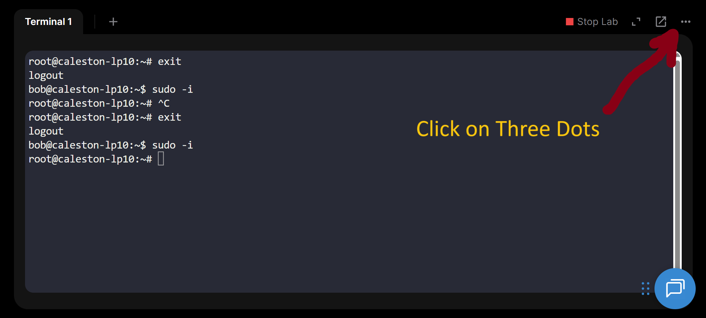
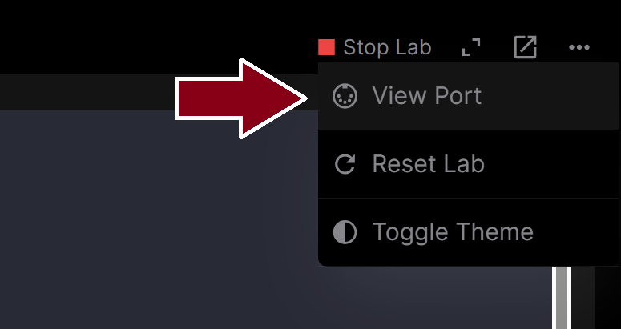
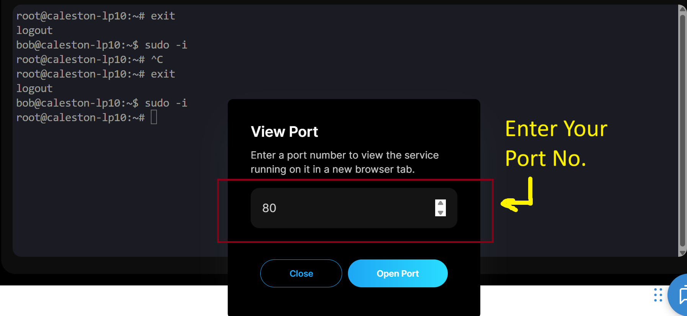
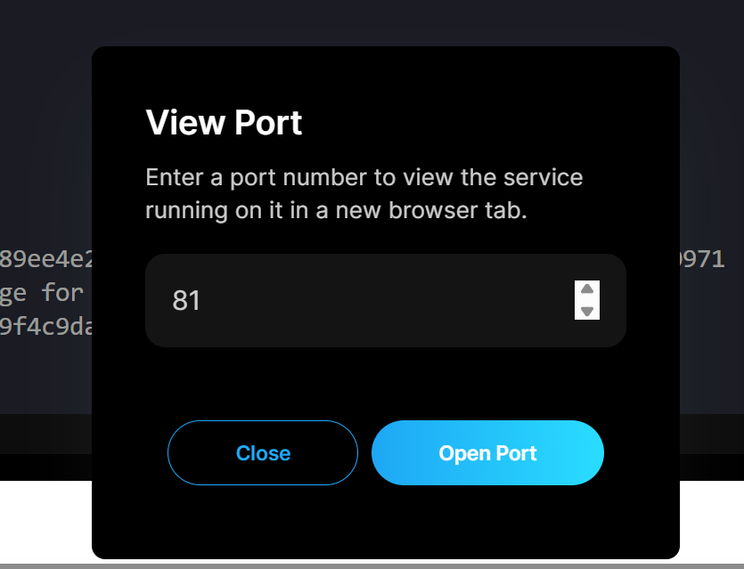
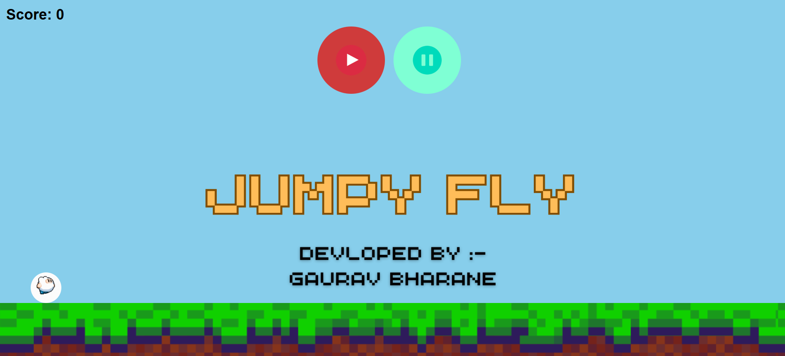

# 🚀 RHA Day Workshop – Hosting Websites & Games with Docker

Welcome to **Red Hat Academy Day (RHA Day)**!  
In this workshop, we will do **two practicals**:  

1. Hosting a static website using **Apache2**  
2. Hosting a **Game using Docker Container**

---

## ⚙️ Prerequisites
- KodeKloud Free Labs (Ubuntu environment) 

Shorten link:
```bash
https://t.ly/9LUBn
```

<center>OR</center> </br>

Orginal Link
 ```bash
https://kodekloud.com/free-labs/linux/working-with-shell-ii
```

<br/>
<br/>
<br/>
<br/>
<br/>


---
## 📝 Part 0: Basic Commands & Setup

### 1. Shifting from Local User to Root
```bash
sudo -i
```
Type Password for our bob user is:
```bash
caleston123
```
---

## 📝 Part 1: Hosting a Website with Apache2

### 1. Install Apache
```bash
sudo apt-get update

```
```bash
sudo apt-get install apache2 -y
```
👉 Installs the Apache web server.  

### 2. Start & Enable Apache
```bash
sudo systemctl start apache2
```
👉 Ensures Apache starts now & automatically after reboot.  

### 3. Download a Custom Web Page
```bash
sudo wget -O /var/www/html/index.html https://raw.githubusercontent.com/Gauravbharane/RHA-DAY/refs/heads/main/index.html
```


### 4. Test the Website
<h4>Click on Three Dots</h4>

<h4>Click on view Port</h4>

<h4>Enter Port no: 80</h4>

<h4>👉 You should see your custom HTML. /h4> 


---

## 📝 Part 2: Hosting a Game with Docker

### 1. Install Docker
```bash
sudo apt update
```
```bash
sudo apt install docker.io -y
```
```bash
sudo systemctl start docker
```

👉 Installs Docker and enables it.  

---

### 2. Run the Game Container
```bash
docker run -d -p 81:80 gauravbharane1839/jumpyfly
```
👉 Runs the JumpyFly game inside a Docker container.  

---

### 3. Access the Game
<h4>Click on Three Dots</h4>

<h4>Click on view Port</h4>

<h4>Enter Port no: 81</h4>


Open in browser:  
<h4>👉 Play the <b>JumpyFly Game 🎮 </b>hosted in Docker. </h4>


---

## ✅ Wrap-Up
- Apache shows how to host a **basic static website**.  
- Docker shows how to **deploy applications** easily (in this case, a game 🎮).  
- This is the foundation for **DevOps & Cloud technologies**.  

---

✍️ **Trainer:** Gaurav Sidharth Bharane  
🎓 *Red Hat Academy Day Workshop*  
